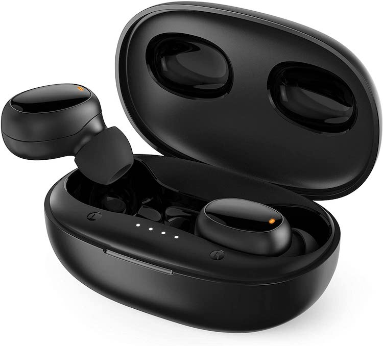

# falwedi-earbud-reset

These inexpensive earbuds work well for listening to music while you exercise or work around the house. Occasionally, they do get out of sync with each other. When this happens, getting them linked back up can be maddening. You'll know you're there's somehting wrong when you can only connect one at a time and you see two entries for "T21" in your bluetooth device list.

You can fix them though and it just takes a bit of patience.

## How to reset and resync falwedi wireless earbuds
Please reset as follows:
1. Please make sure the earbuds are fully charged. 
2. Double tap the Multi-Function Button (MFB) and let both earbuds enter into pairing mode (orange and white lights flicker alternately).
3. Then, triple tap the MFB, with the orange and white lights quickly flash three times, the pairing history will be cleared. (This may not always work.)
4. After that, put the earbuds back into the case and close the case.
5. Open the case again and the earbuds will show a white light first and then an orange light. The orange lights will stay on.
6. Now, the name 'T21' will show in the bluetooth list of your device.

You can also try to pair manually. 
  1. Turn off the earbuds by long press MFB about 10s 
  2. After you open the case and turn on the earbuds by long pressing MFB about 2s, you will see a white light. 
  3. Double tap the MFB and enter into pairing mode
  4. The name 'T21' will show on the bluetooth list.

